import BuyMeACoffeeButton from '@site/src/components/BuyMeACoffeeButton';

## What is Caddy?

**Caddy** is a powerful, modern web server written in Go that stands out for its **automatic HTTPS**, **zero-configuration** approach, and **human-readable configuration**. Unlike traditional web servers that require complex setup procedures, Caddy is designed to work out of the box with sensible defaults while remaining highly configurable for advanced use cases.

### Key Philosophy

Caddy was built with the philosophy that **HTTPS should be the default**, not an afterthought. It automatically obtains and renews SSL/TLS certificates from Let's Encrypt and other Certificate Authorities, making secure web serving accessible to everyone without the traditional complexity.

## Core Features

### 🔒 **Automatic HTTPS**
- **Zero-configuration SSL/TLS**: Automatically obtains certificates from Let's Encrypt
- **Automatic renewal**: Certificates are renewed before expiration
- **OCSP stapling**: Enhanced security and performance
- **HTTP/2 and HTTP/3**: Modern protocol support out of the box

### 🔄 **Reverse Proxy**
- **Load balancing**: Distribute traffic across multiple backends
- **Health checks**: Automatic backend health monitoring  
- **Circuit breaker**: Fail-fast pattern for resilient applications
- **Request/response transformation**: Modify headers, paths, and content

### 📁 **Static File Serving**
- **High performance**: Efficient static content delivery
- **Directory browsing**: Optional file listing capabilities
- **Compression**: Automatic gzip/brotli compression
- **Caching headers**: Optimized browser caching

### 🔌 **Extensible Plugin System**
- **DNS providers**: Cloudflare, Route53, DuckDNS, and 50+ others
- **Authentication**: OAuth, JWT, basic auth, and more
- **Middleware**: Rate limiting, logging, metrics, and custom handlers
- **Storage backends**: Redis, etcd, Consul for distributed configurations

### 📝 **Human-Readable Configuration**
- **Caddyfile**: Simple, intuitive configuration syntax
- **JSON API**: Programmatic configuration management
- **Live reloads**: Configuration changes without downtime
- **Validation**: Built-in configuration syntax checking

## Architecture Overview

Caddy follows a **modular architecture** built around the concept of **middleware** and **handlers**. This design allows for flexible request processing pipelines and easy extensibility.

### Core Components

#### **HTTP Server**
- Multi-protocol support (HTTP/1.1, HTTP/2, HTTP/3)
- Automatic protocol negotiation
- Connection pooling and keep-alive management

#### **Certificate Management**
- ACME client for Let's Encrypt integration
- Certificate storage and retrieval
- Automatic renewal scheduling
- Multiple CA support

#### **Configuration System**
- Caddyfile parser and validator
- JSON configuration API
- Dynamic configuration updates
- Configuration adapters for different formats

#### **Plugin System**
- Modular middleware architecture
- Dynamic plugin loading
- Standardized plugin interfaces
- Community plugin ecosystem

## Traffic Flow Architecture

Understanding how traffic flows through your infrastructure to reach Caddy is crucial for proper setup and troubleshooting. The following diagram illustrates the complete path from user to service:

```mermaid
graph TD
    A[👤 User] --> B[🌐 CDN<br/>CloudFlare/AWS CloudFront]
    B --> C[🔍 DNS Resolution<br/>Domain → IP Address]
    C --> D[🌍 ISP<br/>Internet Service Provider]
    D --> E[📡 Internet Backbone<br/>Routing & Transit]
    E --> F[🏠 Home/Office Router<br/>Port Forwarding]
    F --> G[🔥 Firewall<br/>Security Rules]
    G --> H[⚡ Caddy Web Server<br/>:80 :443]
    H --> I[🔄 Load Balancer<br/>Optional]
    I --> J[🎯 Backend Service<br/>App/Database]
    
    subgraph "Your Infrastructure"
        F
        G
        H
        I
        J
    end
    
    subgraph "External Services"
        B
        C
        D
        E
    end
    
    style A fill:#e1f5fe
    style H fill:#4caf50,color:#fff
    style J fill:#ff9800,color:#fff
    style B fill:#2196f3,color:#fff
    style C fill:#9c27b0,color:#fff
```



### Traffic Flow Breakdown

#### 1. **👤 User Request**
- User enters URL in browser or application makes API call
- Browser initiates DNS lookup and HTTP/HTTPS request
- Request includes headers, cookies, and payload data

#### 2. **🌐 CDN (Content Delivery Network)**
- **Purpose**: Caches static content closer to users globally
- **Popular Services**: Cloudflare, AWS CloudFront, Azure CDN
- **Benefits**: Reduced latency, DDoS protection, bandwidth savings
- **Behavior**: Serves cached content or forwards to origin server

#### 3. **🔍 DNS Resolution**
- **Process**: Domain name → IP address translation
- **Types**: A records (IPv4), AAAA records (IPv6), CNAME (aliases)
- **Providers**: Cloudflare DNS, Google DNS, Route53
- **TTL**: Time-to-live determines caching duration

#### 4. **🌍 ISP & Internet Routing**
- **ISP Role**: User's internet service provider routes traffic
- **BGP Routing**: Border Gateway Protocol determines optimal paths
- **Peering**: ISPs exchange traffic through interconnection points
- **Latency**: Geographic distance and routing efficiency impact speed

#### 5. **🏠 Router & Port Forwarding**
- **NAT**: Network Address Translation maps internal to external IPs
- **Port Forwarding**: Routes specific ports (80, 443) to Caddy server
- **Configuration**: Router admin panel or UPnP automatic setup
- **Security**: Firewall rules and access control

#### 6. **🔥 Firewall & Security**
- **Purpose**: Filter incoming and outgoing network traffic
- **Types**: Hardware firewalls, software firewalls (UFW, Windows Firewall)
- **Rules**: Allow HTTP (80) and HTTPS (443) traffic to Caddy
- **Security**: Block malicious traffic, rate limiting, intrusion detection

#### 7. **⚡ Caddy Web Server**
- **Listening**: Binds to ports 80 (HTTP) and 443 (HTTPS)
- **TLS Termination**: Handles SSL/TLS encryption/decryption
- **Request Processing**: Applies middleware, routing, and transformations
- **Response**: Serves static files or proxies to backend services

#### 8. **🔄 Load Balancer (Optional)**
- **Purpose**: Distributes traffic across multiple backend instances
- **Algorithms**: Round-robin, least connections, weighted distribution
- **Health Checks**: Monitors backend service availability
- **Failover**: Automatically routes around failed services

#### 9. **🎯 Backend Service**
- **Applications**: Web apps, APIs, databases, microservices
- **Protocols**: HTTP, gRPC, WebSocket, TCP/UDP
- **Processing**: Business logic, data retrieval, response generation
- **Response**: Returns data through the same path in reverse

## Common Use Cases

### **Static Website Hosting**
Perfect for serving static sites, SPAs (Single Page Applications), and documentation sites with automatic HTTPS and compression.

```caddyfile
example.com {
    root * /var/www/html
    file_server
    encode gzip
}
```

### **Reverse Proxy**
Route traffic to backend applications, APIs, or microservices with load balancing and health checks.

```caddyfile
api.example.com {
    reverse_proxy localhost:3000 localhost:3001 localhost:3002 {
        lb_policy round_robin
        health_check /health
    }
}
```

### **API Gateway**
Centralize API management with authentication, rate limiting, and request transformation.

```caddyfile
api.example.com {
    rate_limit {
        zone api_zone
        key {remote_host}
        events 100
        window 1m
    }
    
    reverse_proxy /v1/* localhost:8001
    reverse_proxy /v2/* localhost:8002
}
```

### **Development Server**
Quick local development with automatic HTTPS for testing modern web applications.

```caddyfile
localhost:8080 {
    reverse_proxy localhost:3000
    tls internal
}
```

## Advantages Over Traditional Web Servers

### **vs Apache HTTP Server**
- ✅ **Automatic HTTPS** vs manual certificate management
- ✅ **Zero configuration** vs complex virtual host setup  
- ✅ **Built-in reverse proxy** vs separate module configuration
- ✅ **Modern protocols** (HTTP/2, HTTP/3) enabled by default

### **vs Nginx**
- ✅ **Human-readable config** vs complex syntax
- ✅ **Automatic certificate management** vs manual setup
- ✅ **Built-in load balancing** vs upstream module configuration
- ✅ **Dynamic configuration** vs reload requirements

### **vs Traditional Load Balancers**
- ✅ **All-in-one solution** vs separate components
- ✅ **Automatic service discovery** vs manual backend configuration
- ✅ **Built-in health checks** vs external monitoring
- ✅ **Cost-effective** vs expensive hardware/software solutions

## Security Features

### **Automatic Security Headers**
Caddy can automatically add security headers to protect against common web vulnerabilities:

```caddyfile
example.com {
    header {
        # Security headers
        Strict-Transport-Security "max-age=31536000; includeSubDomains; preload"
        X-Content-Type-Options "nosniff"
        X-Frame-Options "DENY"
        X-XSS-Protection "1; mode=block"
        Referrer-Policy "strict-origin-when-cross-origin"
        Content-Security-Policy "default-src 'self'"
    }
    
    reverse_proxy localhost:8080
}
```

### **Rate Limiting**
Protect your services from abuse and DDoS attacks:

```caddyfile
example.com {
    rate_limit {
        zone example_zone
        key {remote_host}
        events 50
        window 1m
    }
    
    reverse_proxy localhost:8080
}
```

### **Authentication**
Built-in authentication mechanisms:

```caddyfile
admin.example.com {
    basicauth {
        admin $2a$14$hashed_password_here
    }
    
    reverse_proxy localhost:8080
}
```

## Performance Characteristics

### **Benchmarks**
- **Memory Usage**: Typically 10-50MB for basic configurations
- **CPU Efficiency**: Go's runtime provides excellent performance
- **Concurrent Connections**: Handles thousands of concurrent connections
- **Throughput**: Comparable to Nginx for static content serving

### **Optimization Features**
- **HTTP/2 Server Push**: Proactively send resources to clients
- **Compression**: Automatic gzip/brotli compression
- **Caching**: Built-in caching mechanisms for static content
- **Connection Pooling**: Efficient backend connection management

## Getting Started

### **Installation Options**

1. **Package Managers**:
   ```bash
   # Ubuntu/Debian
   sudo apt install caddy
   
   # macOS
   brew install caddy
   
   # Windows
   choco install caddy
   ```

2. **Custom Builds**: Download with specific plugins from [caddyserver.com/download](https://caddyserver.com/download)

3. **Docker**: Official Docker images available
   ```bash
   docker run -d -p 80:80 -p 443:443 caddy:latest
   ```

### **Quick Start Example**

1. **Create a Caddyfile**:
   ```caddyfile
   localhost:8080 {
       respond "Hello, Caddy!"
   }
   ```

2. **Run Caddy**:
   ```bash
   caddy run
   ```

3. **Visit**: http://localhost:8080

## Community and Ecosystem

### **Community Resources**
- **Official Documentation**: [caddyserver.com/docs](https://caddyserver.com/docs)
- **Community Forum**: [caddy.community](https://caddy.community)
- **GitHub Repository**: [github.com/caddyserver/caddy](https://github.com/caddyserver/caddy)
- **Discord Server**: Active community chat and support

### **Plugin Ecosystem**
- **50+ DNS Providers**: Automatic certificate validation
- **Authentication Plugins**: OAuth, LDAP, SAML integration
- **Monitoring**: Prometheus metrics, logging, tracing
- **Storage Backends**: Redis, etcd, Consul for clustering

### **Enterprise Support**
- **Commercial Support**: Available through various providers
- **Professional Services**: Configuration, deployment, and optimization
- **Training**: Workshops and certification programs
- **Consulting**: Architecture design and best practices

## Next Steps

Ready to dive deeper into Caddy? Explore our comprehensive installation guides:

### **📚 Installation Guides**
- **[Installing Caddy on Linux](./Linux/Installing_Caddy_on_Linux)**: Complete Ubuntu/Debian/CentOS setup
- **[Installing Caddy on Windows](./Windows/Installing_Caddy_on_Windows)**: Windows Server and desktop installation

### **🔧 Configuration Examples**
- **[Caddy Examples](/Examples/Caddy_Examples)**: Real-world configuration patterns
- **Advanced Configurations**: Load balancing, API gateways, and more

### **🚀 Advanced Topics**
- **Clustering**: Multi-server deployments with shared configuration
- **Monitoring**: Metrics, logging, and observability
- **Security**: Advanced security configurations and best practices
- **Performance**: Optimization techniques and tuning

---

## Summary

Caddy represents a **paradigm shift** in web server technology, prioritizing **ease of use**, **security by default**, and **modern web standards**. Its automatic HTTPS, intuitive configuration, and powerful plugin ecosystem make it an excellent choice for:

✅ **Modern web applications** requiring HTTPS  
✅ **Microservices architectures** needing reverse proxy capabilities  
✅ **Development environments** with rapid iteration requirements  
✅ **Production deployments** demanding reliability and security  
✅ **API gateways** with authentication and rate limiting needs  

Whether you're a **developer** looking for a simple local server, a **system administrator** managing production infrastructure, or a **DevOps engineer** building modern application platforms, Caddy provides the tools and flexibility to meet your needs while maintaining simplicity and security.

<BuyMeACoffeeButton />
